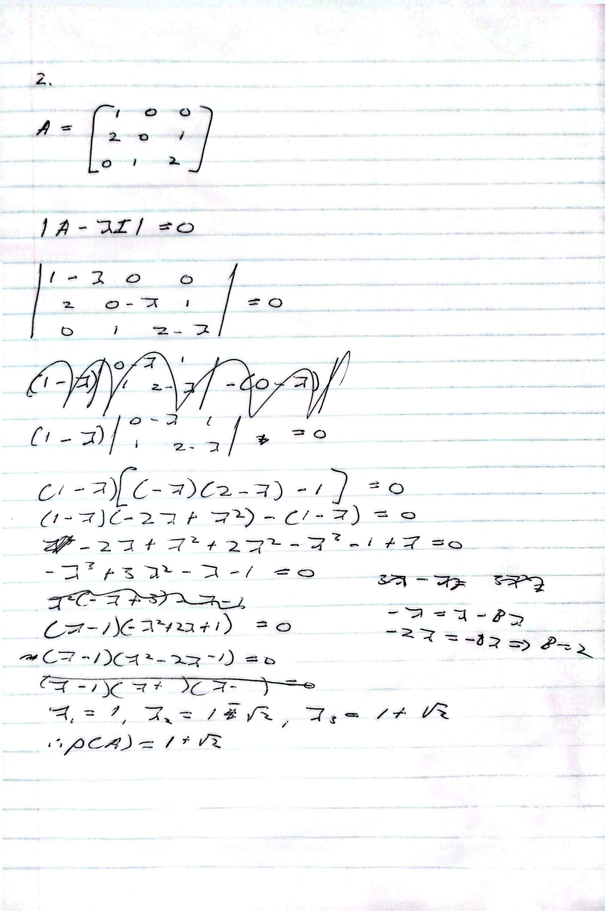

# Chapter 1
### Chapter 1.1
---
#### Terminology

- Degree of a vertex
    - number of incident edges (when unweighted graph)
        - where incident edges refers to an edge that connects two vertices
    - We later find out in this book that degree is actually the sum of weights of adjacent vertices
        - In an unweighted case we consider the weights to be 1
- Loop
    - An edge that only has one endpoint (can be a property of a graph)
    - **Beware** that this adds 2 to the degree of a vertex 
- Subgraph
    - a subset of a graph with the relevant vertices/edges
- Adjacency Matrix     
        - Matrix with row/col corresponding to two vertices. 
        - 1 if adjacent else 0
    - If undirected, symmetric
- Path
    - Sequence of edges that link a pair of vertices
- Connected graph
    - A graph where there is a path between every pair of vertices
        - a simple connected graph **cannot** have loops (not cycles)
- Tree graph
    - Connected but no path back to the same vertex
- In-degree
    - numbr of edges going into a vertex
    - outdegree is the same but out

#### Beyond
- Handshaking Theorem
    - Basically says that the sum of the degree of each vertex is just double the number of edges
        - think abt how if there's an undirected edge between two vertices, they both have in-degree++
- Gramian Matrix `S = AA^T`
    - Useful tool in analysing relationships between vertices
        - Main diagonal shows total # adjacent vertices
        - Other entries tell you how many shared neighbours between vertex i and vertex j
    - Application found in analysing a subgroup of criminals to find the larger group

---
### Chapter 1.2

- The power of _powers_ of Adjacency Matrices
    - When you take a power n you basically find out how many different paths there are of length n to another vertex
    - This can be useful in finding connectedness between suspects as well as contenders in sports tournaments

---
### Chapter 1.3

- Spectral radius
    - refers to largest absolute eigenvalue of a matrix
    - denoted rho(A)

- Eigenvalues
    - When you determine an eigenvector, it is a basis vector for the eigenspace corresponding to an eigenvalue
    - When you multiply an eigenvector with its associated matrix, it will stretch the eigenvector by a factor of its associated eigenvalue
    - A matrix is singular iff at least one of the eigenvalues is zero
    - Since many vectors can be used as the basis vector we stick to unit eigenvectors

- Laplacian Matrix
    - $D - A$
        - Degrees along diagonal
        - -adjacency otherwise
        - Normalised Laplacian
            - L = TLT
                - where T is 1/sqrt(degree_at_pos)

- Spectral Graph Theory
    - Grouping and ranking of vertices based on eigenvectors and eigenvalues of the laplacian matrix
    - Eigenvalues
        - number of eigenvalues corresponds to number of vertices
            - If you see repeats (multiplicties) it just means that eigenvalue corresponds to more than one unique solution
                - When an eigenvalue has a multiplicity of 5, it means there are 5 solutions that cannot be created by scaling each other (linearly independent solutions)
        - Eigenvalue 0 has a multiplicity n where n is the number of components in the graph if disconnected 
        - second smallest eigen is called the **fiedler value** or algebraic connectivity of the graph denoted a(G)
            - only > 0 iff G is connected
                - Note that $\lambda_{2}$ is always positive or zero
                    - This is because we know $\lambda_{1}$ is the smallest eigenvalue by way of $Lx = \lambda_1x$
                        - If the rhs is 0, we know there is always a **non-trivial** solution in col vector of 1's
                            - *Recall that the sum of a row in a Laplacian matrix is 0* (by way of degrees and edges)
                            - We never allow $x$ to be the null vector in said equation as it **doesnt teach us anything**
            - The more the graph is connected the bigger the fiedler value

- Fiedler's Theorem
    - This is used to partition a graph in such a way that minimises the number of edges cut
        - think if you had to cut this manually in a big network you would end up cutting other places to get a clean cut (because you wouldnt know the cleanest spot)
    - If we used this on the crime network example, we would partition the network on the basis of which subgroups were the most connected
        - Another way to think of this is to partitio of the basis of internal connectedness and external sparseness
    - Used on undirected graphs (prereq)
        - Symmetric matrices are guaranteed to have real eigenvalues this allows neat ordering
            - Think about how if they were real/complex it would be difficult saying which is bigger/smaller
            - **Though there do exist spectral clustering techniques for directed graphs**
        - If you must work with a directed graph with fiedler's theorem:
            - You have two options:
                1. convert the directed graph into it's Gramian Matrix ($S = AA^T$)
                    - Idea for the usage here is "if we follow the same people we belong together"
                    - More comp heavy as it's matrix multiplication
                2. its summation/*Symmetrized Adjacency Matrix* ($S = A + A^T$)
                    - Idea for the usage here is "if we have an interaction we should be grouped together"
                    - The summation turns an directed graph into an undirected graph
                    - Computationly easier
            - **both options allow us to work with a symmetric matrix which is the prereq for fiedler's thm**
                - Simple algebraic proof for both (Prove $S = S^T$ to prove symmetry) 
    - Thm itself:
        - $x$: The Fiedler Vector (the whole array).
            - We get this through the standard process of $Lx = \lambda_2x$
                - Recall that this is the same as $(L-\lambda_2 I)x = 0$

        - $j$ (or $i$): The index/ID of a specific vertex.

        - $x_j$: The "Valuation" (the actual number at that index).

        - The Rule: If the valuation ($x_j$) is negative, the vertex belongs to Subgraph 1 ($G_1$). Otherwise, it belongs to Subgraph 2 ($G_2$).

- Quadratic form of a symmetric* matrix:
    1. $x^TAx$
    2. *
- A real $n * n$ symmetric matrix is called:
    1. Positive definite
    2. Positive semidefinite
    3. Negative definite
    4. Negative semidefinite

- If A is an $n * n$ real positive semi-definite matrix, all the eigenvalues are non-negative

- Steady State Vector
    - *In math if there's a value $x$ for a function where $f(x) = x$, we call that the steady state value*
    - if $\lambda = 1$, there exists a positive integer k where $A^kx = x$
        - since the value of x remains fixed despite being multiplied by A, we call this the *steady state vector*

- Spectral Theorem
    - If A is $n * n$ real symmetric matrix we can decompose it into $A = U \Lambda U^T$
        - $\Lambda$: Diagonal matrix with each diagonal entry corresponding to $\lambda_i$
        - $U$: Columns of U are orthonormal bases vectors for the corresponding eigenspaces of A

//

---
### Chapter 1.6 Exercises

**1**-
 
a. 2
 
b. 
$$
A^2 = \begin{pmatrix} 
2 & 1 & 1 & 1 & 2 & 1 \\
1 & 4 & 1 & 1 & 2 & 1 \\
1 & 1 & 2 & 2 & 0 & 2 \\
1 & 1 & 2 & 3 & 0 & 2 \\
2 & 2 & 0 & 0 & 3 & 0 \\
1 & 1 & 2 & 2 & 0 & 2
\end{pmatrix}
$$

2-step connections to others from kush: $1 + 1 + 1+ 1 + 1 = 6$

*row/col 1 excluding kash ("others") himself. Consider the 2 as 1 in sum since it is just a connection to one person*
 
c. 
1-step = 1

2-step = 1

*since undirected graph (by way of the symm. adj. matrix) we usually count the one link as one. We're counting unique physical connections*
 
**2-**

**3-**
Not a simple connected graph as there is a self-loop at $A_{11}$

*can also use laplacian; if $\lambda = 0$ -> multiplicity = 1 -> connected*

**4-**

**a**
$$
A = \begin{pmatrix}
0 & 1 & 0 & 0 & 0 & 0 & 1 & 1 & 0 & 0 \\
1 & 0 & 1 & 0 & 0 & 0 & 0 & 0 & 0 & 0 \\
0 & 1 & 0 & 1 & 0 & 0 & 0 & 0 & 0 & 0 \\
0 & 0 & 1 & 0 & 1 & 0 & 0 & 0 & 0 & 0 \\
0 & 0 & 0 & 1 & 0 & 1 & 0 & 0 & 0 & 0 \\
0 & 0 & 0 & 0 & 1 & 0 & 1 & 0 & 0 & 0 \\
1 & 0 & 0 & 0 & 0 & 1 & 0 & 0 & 0 & 0 \\
1 & 0 & 0 & 0 & 0 & 0 & 0 & 0 & 1 & 1 \\
0 & 0 & 0 & 0 & 0 & 0 & 0 & 1 & 0 & 1 \\
0 & 0 & 0 & 0 & 0 & 0 & 0 & 1 & 1 & 0
\end{pmatrix}
$$

**b**
$$
A = \begin{pmatrix}
0 & 1 & 0 & 0 & 0 & 0 & 1 & 1 & 0 & 0 \\
1 & 0 & 1 & 0 & 0 & 0 & 0 & 0 & 0 & 0 \\
0 & 1 & 0 & 1 & 0 & 0 & 0 & 0 & 0 & 0 \\
0 & 0 & 1 & 0 & 1 & 0 & 0 & 0 & 0 & 0 \\
0 & 0 & 0 & 1 & 0 & 1 & 0 & 0 & 0 & 0 \\
0 & 0 & 0 & 0 & 1 & 0 & 1 & 0 & 0 & 0 \\
1 & 0 & 0 & 0 & 0 & 1 & 0 & 0 & 0 & 0 \\
1 & 0 & 0 & 0 & 0 & 0 & 0 & 0 & 1 & 1 \\
0 & 0 & 0 & 0 & 0 & 0 & 0 & 1 & 0 & 1 \\
0 & 0 & 0 & 0 & 0 & 0 & 0 & 1 & 1 & 0
\end{pmatrix}
$$

// left off at solving 4c with numpy
