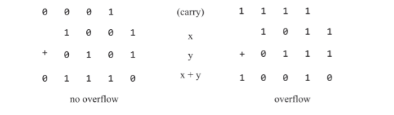

# Chapter 2 Boolean Arithmetic

The ALU (*Arithmetic Logic Unit*) is the computational centerpiece of the CPU

---

### Arithmetic Operations
General computers are meant to perform at least the following operations on signed ints:
- addition
- sign conversion
- subtraction
- comparison
- multiplication
- division

* all functions performed by digital computers can be reduced to addition (of binary numbers)

---

### Binary numbers

- Word size
    - refers to the number of bits a computer uses to represent basic info
        - can be 8, 16, 32, 64 bit registers
    - this fixed word size implies there is a fixed size on the numbers we can represent
    - in general with n-bits we can represent $2^n -1$
    - for numbers beyond our word size
        - most abstractions are implemented by using as many n-bit registers as needed
---

### Binary addition

Numbers in binary can be added bitwise the same we do in base 10, carry and all

(Source: The Elements of Computing Systems (Nand2Tetris) by Nisan and Schocken)

for now we are comfortable with ignoring overflow. ignoring overflow is fine as long as you acknowledge it.

---

### Signed Binary Numbers
- As we know there are three major schemes for representing numbers in binary for systems
    - Sign & Magnitude
    - One's Compliment
    - Two's Compliment
        - this one wins as it involves the least difficulty implementing (avoid multiple 0s and look up the rest)
        - trick is a negative number $x$ is represented by $2^n - x$
            - so just convert that representation to binary and ur done
            - addition works. we are still ignoring overflow though.

either way though all three use the first bit to indicate whether a number is positive or negative.

